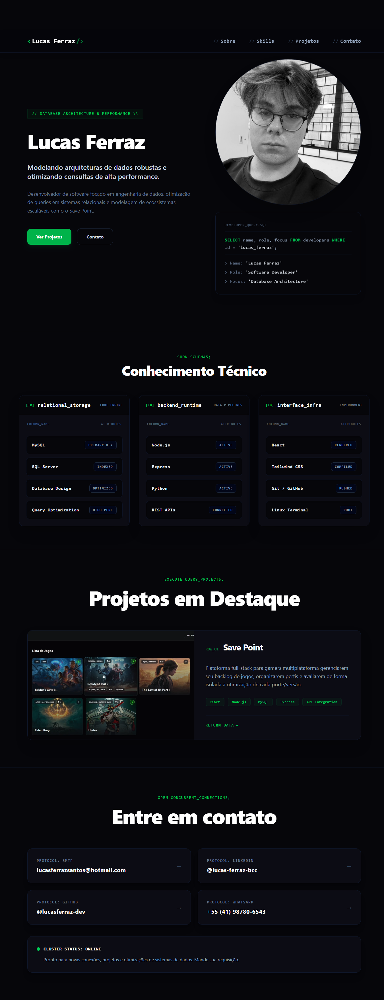

# Portfólio - Lucas Ferraz dos Santos

Portfólio pessoal desenvolvido para apresentar minha trajetória acadêmica,
experiências profissionais, projetos e conhecimentos na área de tecnologia.

🌐 **Acesse:** https://ferrazdeveloper.com

## 🚀 Tecnologias

- React
- Vite
- Tailwind CSS
- Framer Motion
- JavaScript

## ✨ Funcionalidades

- Apresentação profissional
- Seção de habilidades e tecnologias
- Experiências profissionais
- Projetos desenvolvidos
- Links para GitHub e LinkedIn
- Animações e transições de interface
- Design responsivo para diferentes dispositivos

## 🛠️ Desenvolvimento

O projeto foi desenvolvido utilizando React com Vite, utilizando Tailwind CSS
para estilização e Framer Motion para animações e transições da interface.

## ▶️ Como executar

Clone o repositório:

```bash
git clone https://github.com/lucasferraz-dev/Portfolio-LucasDev.git
```

Entre na pasta:

```bash
cd portfolio-LucasDev
```

Instale as dependências:

```bash
npm install
```

Execute o projeto:

```bash
npm run dev
```

O projeto estará disponivel no endereço informado pelo Vite no terminal.

## 📌 Autor

Lucas Ferraz dos Santos

GitHub: https://github.com/lucasferraz-dev

LinkedIn: https://www.linkedin.com/in/lucas-ferraz-bcc

Portfólio: https://ferrazdeveloper.com

## 📸 Preview


